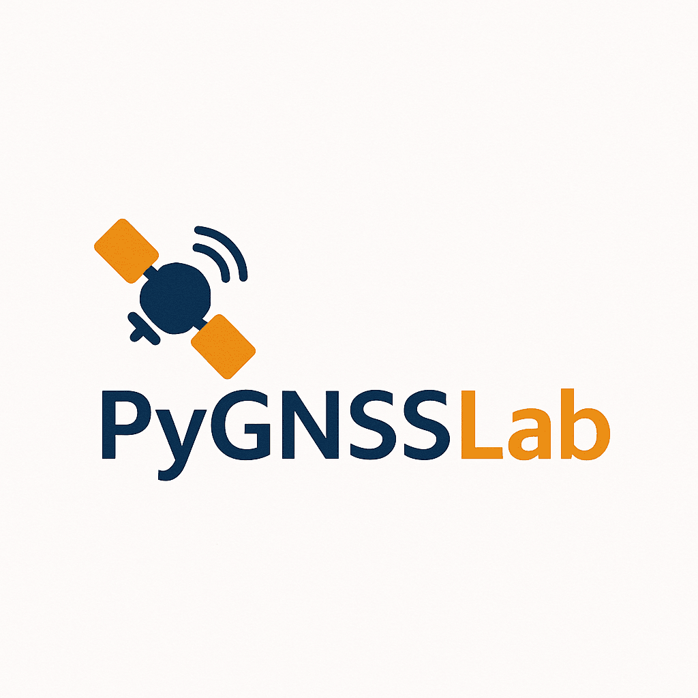

# pygnsslab
Open-source Python-based GNSS software.



# PyGNSSLab
**PyGNSSLab** is an open-source project focused on developing modular, Python-based GNSS tools and libraries. Our aim is to provide accurate, reliable, and extensible solutions for GNSS data processing — from basic RINEX handling to advanced PPP-AR techniques.

## 🔍 Key Features

- 🛰️ RINEX reading & conversion tools
- 📡 PPP and PPP-AR processing engines
- 🧪 Real-time GNSS data stream support
- 🧰 Modular structure for research & development
- 📦 Ready-to-use APIs and command-line tools

## 💡 Who is it for?

- Geodesists & Earth scientists
- Researchers working on GNSS positioning
- Developers creating custom GNSS pipelines
- Students learning GNSS with Python

## 📁 Modules

This organization hosts multiple standalone and integrated modules:
- **RINEX2**: A comprehensive parser for RINEX 2.x observation files, supporting:
  - Fast reading of observation data
  - Metadata extraction
  - Export to Parquet format for efficient storage
  - JSON metadata output
  
  - [Example usage](src/pygnsslab/io/rinex2/example_usage.py)
  - [Test output](tests/rinex2/test_output.py)

- **RINEX3**: Modern RINEX 3.x file handler with features for:
  - Multi-GNSS observation data parsing
  - Complete metadata extraction
  - Parquet file conversion
  - Standardized JSON metadata output
  
  - [Example usage](src/pygnsslab/io/rinex3/example_usage.py)

- **Coming Soon**:
  - SPP Capabilities
  - PPP/PPP-AR Processing Engine
  - Real-time Data Stream Handler
  - Troposphere & Ionosphere Models
  - Orbit & Clock Products Interface

## 🚀 Getting Started

### Installation

Follow these steps to get PyGNSSLab set up on your local machine:

1.  **Clone the repository:**
    ```bash
    git clone https://github.com/PyGNSSLab/pygnsslab.git
    cd pygnsslab
    ```

2.  **Create and activate a virtual environment (Recommended):**
    ```bash
    python -m venv venv
    # On Windows
    .\venv\Scripts\activate
    # On macOS/Linux
    source venv/bin/activate
    ```

3.  **Install the required dependencies:**
    ```bash
    pip install -r requirements.txt
    ```

Now you're ready to use the PyGNSSLab tools and libraries!

## 📜 License

All repositories under PyGNSSLab are released under the **MIT License** unless otherwise specified.

---

> Made with 🛰️ by the GNSS community, for the GNSS community.
